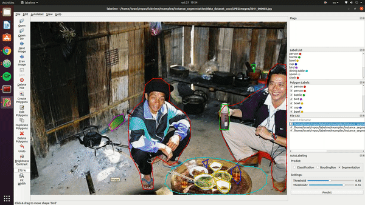
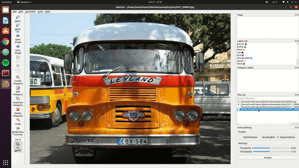
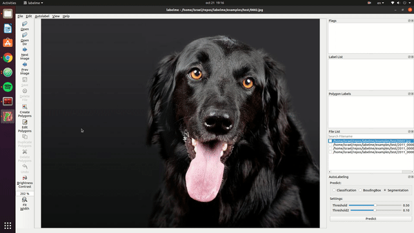

<h4 align="center">
  INTELLIGENT ANNOTATION TOOL
</h4>

<!-- <div align="center">
  <a href="https://pypi.python.org/pypi/labelme"></a>
  <a href="https://pypi.org/project/labelme"></a>
  <a href="https://github.com/wkentaro/labelme/actions"></a>
  <a href="https://hub.docker.com/r/wkentaro/labelme"></a>
</div> -->


<div align="center">
  <a href="#Description"><b>Description</b></a> |
  <a href="#installation"><b>Installation</b></a> |
  <a href="#usage"><b>Usage</b></a>
</div>

<br/>



<p align="center" ><i>Example of instance segmentation.</i></p>

## Description
Autolabelme is a graphical image annotation tool built over [labelme](https://github.com/wkentaro/labelme/) to speed up the annotation process using a pretrained model.

It is written in Python and uses Qt for its graphical interface.


  



<i>Other examples (semantic segmentation, bbox detection, and classification).</i>


## Features
It inherits all the labelme features, but also it automates the following features:
- Auto-segmentation using a pretrained model (MaskRCNN)
- Auto-correction using pixel aggregation (Skimage)
- GUI customization

## Requirements
- Ubuntu / Windows
- Python3
- PyQt5

- Torch and TorchVision (to run inference)
- Scikit-learn and Scikit-image (to correct the images)


## Installation
### Anaconda
### Ubuntu

```
In a fresh environment

git clone https://github.com/IsRaTiAlv/labelme.git
cd labelme/
python setup.py install
pip install labelme
Install pytorch depending on your enviroment (https://pytorch.org/get-started/locally/)
pip install scikit-image
```

### Windows


## Usage
python labelme/__main__.py

The annotated images are saved in `.jpg` format}

## Authors
* [Israel Tiñini Alvarez](mailto:ir.tinini@acad.ucb.edu.bo)
* Benjamin Pinaya

## Cite This Project

If you use this project in your research or wish to refer to the baseline results published in the README, please use the following BibTeX entry.

```bash
@misc{Autolabelme,
  author =       {Israel Tiñini and Benjamin Pinaya},
  title =        {Autolabelme: Intelligent labeling tool},
  howpublished = {\url{https://github.com/IsRaTiAlv/labelme}},
  year =         {2020}
}
```
